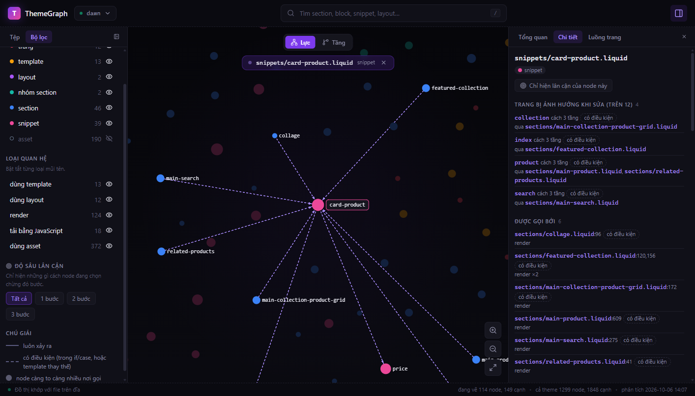

# ThemeGraph

ThemeGraph đọc mã nguồn của một Shopify theme (Liquid) và dựng thành một đồ thị: file nào render file nào, trang nào dùng file nào. Từ đồ thị đó nó trả lời ngay những câu mà bình thường phải `grep` qua nhiều tầng file mới ra:

- Sửa `snippets/card-product.liquid` thì những trang nào bị ảnh hưởng?
- Trang product render những file nào, lồng nhau ra sao?
- File nào trong theme không còn trang nào dùng tới?

Có ba cách dùng, cùng một dữ liệu: dòng lệnh, giao diện web, và MCP server cho AI agent (Claude Code, Cursor).

*ThemeGraph builds a knowledge graph of a Shopify Liquid theme and answers impact, render-flow and dead-code questions from the CLI, a web UI, or an MCP server. This README is in Vietnamese.*



## Cần gì

Node.js 22.13 trở lên. Không cần gì khác: gói cài đã chứa sẵn mọi thứ, kể cả giao diện web.

Chạy được trên Windows, macOS và Linux.

## Cài

```sh
npm install -g https://github.com/nndh2k4/themegraph/releases/latest/download/themegraph.tgz
themegraph --version
```

Lệnh trên cũng dùng để nâng lên bản mới.

Nếu máy không ra mạng được, tải file `themegraph.tgz` ở trang [Releases](https://github.com/nndh2k4/themegraph/releases) rồi cài từ file. Nhớ có `./` ở đầu, không thì npm hiểu nhầm thành tên một repo:

```sh
npm install -g ./themegraph.tgz
```

## Năm phút đầu

**1. Phân tích theme.** Đứng trong thư mục theme (thư mục có `sections/`, `snippets/`, `templates/`):

```sh
themegraph analyze
```

```
ThemeGraph 0.1.0 — đã phân tích C:\Users\DELL\themes\dawn

  File        345
  Node        1299  (asset 190, config 2, layout 2, locale 31, ...)
  Cạnh        1848  (LOADS_SECTION 18, READS_SETTING 834, RENDERS 124, ...)

Tham chiếu hỏng (7):
  sections/main-password-header.liquid:84  asset -> assets/icon-error
  ...

Đã ghi C:\Users\DELL\themes\dawn\.themegraph\graph.db (554 ms)
```

Lệnh này chỉ đọc file của theme. Thứ duy nhất nó ghi là thư mục `.themegraph/` trong theme; thư mục đó tự kèm một `.gitignore` nên không lọt vào commit của bạn.

**2. Hỏi một câu.**

```sh
themegraph impact snippets/card-product.liquid
```

```
Sửa snippets/card-product.liquid (snippet) ảnh hưởng 10 file và 4 trên 12 trang.

Trang (4):
  collection  cách 3 tầng  [có điều kiện]  qua sections/main-collection-product-grid.liquid
  index       cách 3 tầng  [có điều kiện]  qua sections/featured-collection.liquid
  product     cách 3 tầng  [có điều kiện]  qua sections/main-product.liquid, sections/related-products.liquid
  search      cách 3 tầng  [có điều kiện]  qua sections/main-search.liquid
```

**3. Mở giao diện.**

```sh
themegraph serve
```

Rồi mở `http://localhost:7777`. Gõ `/` để tìm một file, bấm vào một node để xem chi tiết, hoặc mở tab "Luồng trang" để xem một trang kéo theo những file nào.

## Các lệnh

| Lệnh | Trả lời câu hỏi |
| --- | --- |
| `themegraph analyze [thư-mục]` | Phân tích theme và ghi đồ thị. Chạy lại sau khi sửa file |
| `themegraph impact <file>` | Sửa file này thì file nào, trang nào bị ảnh hưởng |
| `themegraph render-flow <trang>` | Trang này render những file nào, lồng nhau ra sao |
| `themegraph context <file>` | File này là gì, ai gọi nó, nó gọi ai, đọc setting và khoá dịch nào |
| `themegraph dead-code` | File, khoá dịch và setting nào không còn được dùng |
| `themegraph search [từ-khoá]` | Tìm file, trang, khoá dịch, setting theo tên |
| `themegraph overview` | Số liệu của cả theme |
| `themegraph status` | Đồ thị còn khớp với file trên đĩa không |
| `themegraph list` | Các theme đã phân tích trên máy này |
| `themegraph serve [--port n]` | Mở giao diện web và API |
| `themegraph setup` | Nối ThemeGraph vào Claude Code và Cursor |
| `themegraph clean [--all]` | Xoá dữ liệu ThemeGraph của theme này (hoặc mọi theme) |
| `themegraph verify` | Tự kiểm: đối chiếu hai cách duyệt đồ thị |

Tên file là đường dẫn tính từ gốc theme (`snippets/price.liquid`); gõ tên trần (`price`) cũng được nếu không trùng. Tên trang là `product`, `collection`, `index`, `cart`...

Mọi lệnh hỏi chạy trên theme chứa thư mục đang đứng; thêm `-t <thư-mục>` để chỉ theme khác. Thêm `--json` để lấy kết quả cho script, `--limit <n>` để cắt danh sách dài. `themegraph --help` in đủ.

## Đọc kết quả

**`[có điều kiện]`**: quan hệ chỉ xảy ra trong một nhánh `` / ``, hoặc ở một template thay thế (ví dụ `product.alt.json`). Trên giao diện nó là mũi tên nét đứt.

**`[qua JavaScript]`**: file chỉ lên trang khi JavaScript của theme tải riêng một section (giỏ hàng dạng ngăn kéo, xem nhanh sản phẩm).

**`dead-code` chia ba nhóm, và chỉ nhóm đầu là xoá được:**

| Nhóm | Nghĩa | Nên làm |
| --- | --- | --- |
| Chắc chắn không dùng | Đồ thị không thấy cách dùng nào | Tìm tên file một lượt nữa rồi xoá |
| Cần xem lại | Không thấy ai dùng, nhưng loại file này còn cách dùng mà công cụ không nhìn thấy: section có thể được JavaScript tải bằng tên là biến, asset có thể được gọi bằng tên ghép lúc chạy | Tự kiểm trước khi xoá |
| Có nơi dùng thẻ nhưng không trang nào nạp file | File JavaScript định nghĩa một custom element mà theme đang viết ra, nhưng không thẻ `<script>` nào nạp nó | **Không xoá.** Đây là lỗi của theme: thêm thẻ `<script>` |

**Đồ thị cũ.** ThemeGraph trả lời từ lần phân tích gần nhất. Sửa file xong mà chưa `analyze` lại thì kết quả có thể thiếu thay đổi đó. `themegraph status` cho biết file nào đã đổi; giao diện web báo ở thanh dưới; các tool MCP kèm cảnh báo trong câu trả lời.

## Nối với AI agent

```sh
themegraph setup
```

Lệnh này đăng ký ThemeGraph làm MCP server cho Claude Code và Cursor (client nào có trên máy thì nối client đó), và cài một skill dặn Claude Code khi nào nên dùng nó. Thêm `--dry-run` để chỉ xem nó sẽ ghi gì, `--remove` để gỡ.

Sau đó, trong một thư mục theme đã `analyze`, cứ hỏi agent bằng lời thường:

> Tôi định sửa `snippets/price.liquid`. Những trang nào bị ảnh hưởng?

Agent có sáu tool: `impact`, `render_flow`, `context`, `search`, `dead_code`, `list_themes`. Server chỉ đọc: nó không sửa theme và không tự phân tích lại.

## Dữ liệu nằm ở đâu

- `<theme>/.themegraph/graph.db`: đồ thị của theme đó (SQLite).
- `~/.themegraph/`: danh sách các theme đã phân tích. Đặt biến môi trường `THEMEGRAPH_HOME` để đổi chỗ.

ThemeGraph không gửi gì ra mạng. `themegraph serve` chỉ nghe trên máy của bạn (`localhost`), và API của nó không trả nội dung file của theme.

## Giới hạn đã biết

ThemeGraph phân tích tĩnh: nó đọc mã, không chạy theme. Vì vậy:

- Tên file ghép lúc chạy (`'icon-' | append: name`) không thành quan hệ.
- JavaScript không được phân tích cú pháp. Công cụ chỉ dò vài cách viết quen thuộc: section được tải qua Section Rendering API bằng tên viết sẵn, và `customElements.define("tên")`.
- Section do JavaScript tải bằng tên là biến nằm ngoài đồ thị; `dead-code` xếp nó vào nhóm "cần xem lại".
- Thư mục `listings/` không được quét.
- Setting được truyền cả bộ cho snippet (`render 'x', settings: block.settings`) rồi snippet mới đọc thì công cụ không lần theo. Theme viết theo kiểu này (ví dụ Horizon của Shopify) sẽ có rất nhiều setting nằm trong danh sách "không thấy đọc" của `dead-code` dù đang được dùng. Danh sách đó luôn là "cần xem lại", không phải "xoá được".
- Những gì merchant thêm từ theme editor mà không nằm trong file của theme (app block, nội dung nhập tay) thì công cụ không biết.
- Nhóm "có nơi dùng thẻ nhưng không trang nào nạp file" chỉ xét file JavaScript mà không trang nào nạp. File được nạp ở trang này nhưng thẻ viết ở trang khác thì chưa phát hiện.

Kết quả của `impact` và `dead-code` là căn cứ để kiểm, không thay cho việc kiểm.

## Gỡ cài

```sh
themegraph setup --remove     # gỡ khỏi Claude Code và Cursor
themegraph clean --all        # xoá .themegraph/ trong mọi theme đã phân tích
npm uninstall -g themegraph
```

## Phát triển

Cần Node 22.13 trở lên và pnpm.

```sh
git clone https://github.com/nndh2k4/themegraph.git
cd themegraph
pnpm install
pnpm test          # build, rồi chạy toàn bộ test
pnpm run pack      # đóng gói thành release/themegraph-<phiên bản>.tgz
```

Mã chia năm gói trong `packages/`: `core` (đọc theme, dựng và truy vấn đồ thị), `cli`, `mcp`, `server` (API cho giao diện) và `web` (giao diện). Ba lớp vỏ chỉ gọi vào `core`; không lớp nào tự đọc Liquid.

`node tools/release/smoke.mjs --theme <thư-mục>` kiểm một bản đã cài qua đủ ba lớp vỏ; CI chạy nó trên Ubuntu, Windows và macOS với gói vừa đóng.

## Giấy phép và ghi nhận

Mã của ThemeGraph phát hành theo giấy phép ISC (xem [LICENSE](LICENSE)). Gói cài có gộp một số thư viện mã nguồn mở; giấy phép của chúng nằm trong file `THIRD-PARTY-LICENSES.txt` của gói.

Bố cục và phong cách của giao diện web làm theo giao diện của [GitNexus](https://github.com/abhigyanpatwari/GitNexus); mã thì viết riêng cho ThemeGraph.
